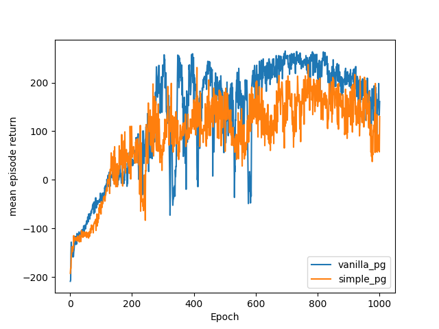

# RLPlayground
## Experiment 1
- Env: LunarLander-v2
- Batch size: 5000
- Model: MLP 1 hidden layer (hidden size = 32)
- Optimizer: Adam (lr = 1e-2)
- Algorithms: Simple PG, Vanilla PG (Simple PG + baseline)

Coming late: DQN, TRPO, PPO, DDPO
